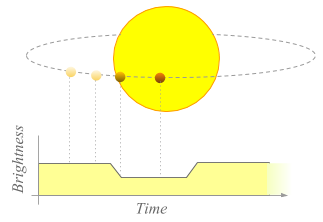
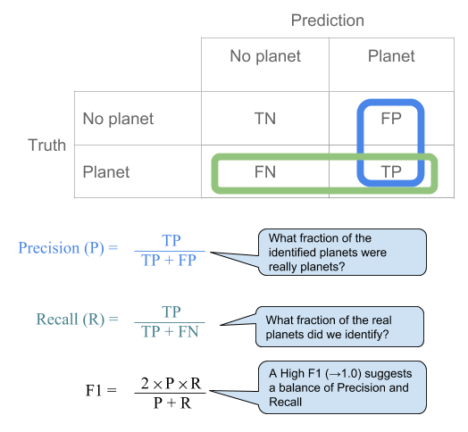
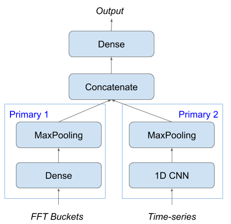

# Detecting Exoplanets from NASA Kepler Data  

**Machine Learning Engineer Nanodegree**  
**Capstone Proposal**  
Will Gilpin  
July 25, 2018  

### Domain Background
One of the Great Questions of our time is that of the existence of non-terrestrial life. Of special relevance is the search for life from outside our solar system, as that would suggest a separate origin of that life, showing evolution has produced life at least twice, and therefore possibly many times. As part of this quest astronomers have been looking for planets with similar conditions to earth in terms of size, solidity and temperature range. Such planets will then become candidates for further investigation.  
The Kepler mission was launched in 2009 in order to monitor 156,000 stars in the areas of Cygnus & Lyra with the intention of detecting earth-like planets in the stars' habitable zones [\[Borucki, 2010\]][BORUCKI]. The basic mechanism for detection is simple: monitor the light of a star over a period of time and look for periodic reduction in the brightness of the star for period in the range 2-16 hours [\[NASA, 2018\]][NASA1], this dimming being caused by the obscuration of a small fraction of the stars light during the planets transit between the observer and the star.  
  
*Star light dimmed by transiting planet*  

### Problem Statement

The problem is to identify stars with planets given time-series data of stellar brightness from stars in the Kepler survey.
The approach is to find periodic brightness variations in the range of 2-16 hours which would therefore suggest a transiting orbital body.  

### Datasets and Inputs

The datasets being used are from NASA and were published for use in the Kaggle "Exoplanet Hunting" competition [\[Kaggle, 2018\]][Kaggle].  The data has been cleaned by removing sensor artefacts, translating to a linear scale, removing likely cosmic ray artefacts, removing background flux and summing values over the photometric aperture of the target star image. They are then further pre-processed to allow for focusing and pointing artefacts, and for gaps in the time series [\[Jenkins, 2018\]][JENKINS].  
The structure of the dataset is simple. Each row consists of a single label, `LABEL`, then 3197 flux points in columns `FLUX.1` to `FLUX.3197` representing flux values from *t=1* to *t=3197*. The scale of the data points is unclear and will need normalising.

### Solution Statement

There is an experimental element to this project, and so two approaches will be taken which may be joined later.

Firstly the raw data will be pre-processed using Fourier transforms to identify cyclic features. A Fast Fourier Transform will provide additional features for the dataset based on any periodic elements in the data, and as the planets we are seeking have a clear range of orbital periods it may be of value [\[Garza, 2015\]][GARZA].
Secondly a model will be constructed using 1D convolutional neural networks over the NASA time-series data, as per the approach in [\[Shallue, 2018\]][SHALLUE].  
The output of each of these models will then be fed into a multi-input model for comparison (parallel sub-networks for the time-series data and the generated Fourier analysis) \[Chollet, 2018\].
  
### Benchmark Model

The model will be benchmarked against the labelled data supplied in the Kaggle dataset. The labels are as derived by the Kepler Science Processing Pipeline. The Kepler model is, by design, more sophisticated than the one proposed herein:
 > Ancillary engineering data and diagnostic information
extracted from the science data are used to remove systematic errors in the flux time series that are correlated with
these data prior to searching for signatures of transiting planets with a wavelet-based, adaptive matched filter. Stars
with signatures exceeding 7.1σ are subjected to a suite of statistical tests including an examination of each star’s
centroid motion to reject false positives caused by background eclipsing binaries.  
[\[Jenkins, 2010\]][JENKINS2010]

This additional complexity allows us to be reasonably confident that the labels are accurate.

### Evaluation Metrics

Evaluation of the model is relatively simple given that this is a binary classification task with labelled data. Given the large skew in the dataset towards `no planet` we need to balance precision and recall. For publication purposes we might opt for high precision, so that the positives are more likely to be true-positives. However for research purposes higher recall will positively identify more of the actual systems with planets, at the expense of false positives. These false positives might still, though, be good candidates for further investigation given that they show hints of periodicity.
For the purposes of this project we will use the F1 score.

  

### Project Design

The design of the project follows these steps:

  1. Augment the data for training. The dataset has only about 1% positives, so construct a more balanced training set by randomly removing a proportion of the true negatives (this will be hyperparameter controlled and subject to tuning)
  2. Pre-process using Fourier transforms to identify cyclic features. A Fourier frequency analysis provides additional features, and as the planets we are seeking have a clear range of orbital periods it may be of value [\[Garza, 2015\]][GARZA].
  3. **Primary Model 1** Train a sequential model on the Fourier frequency buckets.
  4. **Primary Model 2** Train a second sequential model using 1D convolutions over the time-series data, as per the approach in [\[Shallue, 2018\]][SHALLUE].
  5. Construct a multi-input model for comparison (parallel sub-networks for the time-series data and the generated Fourier analysis) \[Chollet, 2018\].
  6. Tune the hyperparameters to optimise the results.
  7. Select final model - which might be either of primary models, or the composite model, depending on performance.

Note the primary models will each require an additional dense output layer if operating in isolation.

  
*Keras Model Architecture*

-----------

# References
[KEPLER1]: https://keplerscience.arc.nasa.gov/objectives.html  
Barentsen, G. (2018). Mission objectives. [online] Kepler & K2. Available at: [keplerscience.arc.nasa.gov/objectives.html](https://keplerscience.arc.nasa.gov/objectives.html) [Accessed 25 Jul. 2018].  

[BORUCKI]: https://doi.org/10.1126/science.1185402
Borucki, W.J. et al. (2010). Kepler Planet-Detection Mission: Introduction and First Results. Science 327, 977–980. [doi.org/10.1126/science.1185402](https://doi.org/10.1126/science.1185402)

Chollet, F. (2018). Deep learning with Python. Manning, pp.238-240.

[GARZA]: https://medium.com/@gabogarza/exoplanet-hunting-with-machine-learning-and-kepler-data-recall-100-155e1ddeaa95
Garza, G. (2018). Exoplanet Hunting with Machine Learning and Kepler Data. [online] Medium. Available at: [medium.com/@gabogarza/exoplanet-hunting-with-machine-learning-and-kepler-data-recall-100-155e1ddeaa95](https://medium.com/@gabogarza/exoplanet-hunting-with-machine-learning-and-kepler-data-recall-100-155e1ddeaa95) [Accessed 26 Jul. 2018].

[JENKINS]: https://keplerscience.arc.nasa.gov/data-products.html
Jenkins, J. (2018). Kepler Data Processing Handbook. [ebook] NASA Ames Research Center, p.6. Available at: [archive.stsci.edu/kepler/manuals/KSCI-19081-002-KDPH.pdf](https://archive.stsci.edu/kepler/manuals/KSCI-19081-002-KDPH.pdf) [Accessed 26 Jul. 2018].

[JENKINS2010]: https://doi.org/10.1088/2041-8205/713/2/L87
Jenkins, J.M. et al. 2010. Overview of the Kepler Science Processing Pipeline. The Astrophysical Journal 713, L87–L91. https://doi.org/10.1088/2041-8205/713/2/L87

[Kaggle]: https://www.kaggle.com/keplersmachines/kepler-labelled-time-series-data/home
Kaggle. (2018). Kepler labelled time series data. [online] Available at: [www.kaggle.com/keplersmachines/kepler-labelled-time-series-data/home](https://www.kaggle.com/keplersmachines/kepler-labelled-time-series-data/home) [Accessed 26 Jul. 2018].  

[NASA1]: https://www.nasa.gov/mission_pages/kepler/overview/index.html  
NASA. (2018). Mission overview. [online] Available at: [www.nasa.gov/mission_pages/kepler/overview/index.html](https://www.nasa.gov/mission_pages/kepler/overview/index.html) [Accessed 26 Jul. 2018].  

[SHALLUE]: https://doi.org/10.3847/1538-3881/aa9e09  
Shallue, C.J., Vanderburg, A. (2018). Identifying Exoplanets with Deep Learning: A Five-planet Resonant Chain around Kepler-80 and an Eighth Planet around Kepler-90. *The Astronomical Journal* 155, 94. https://doi.org/10.3847/1538-3881/aa9e09  
